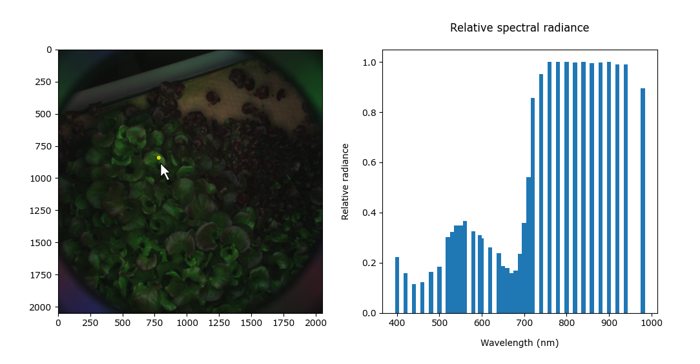

## Process-ENVI-Image

I was approached by a botanist who needed help processing multispectral images. The equipment she was using provided images in the ENVI format, which consists of a .raw file containing the raw pixel data for each band and a .hdr file, which describes the data. There was limited support for this format available online so I produced this script as well as an executable packaged using PyInstaller and Inno.

When a .raw image is dragged onto the program, it's accompanying .hdr header file is found and the image is opened. The program gives you the option of exporting all spectral bands as labelled TIFF files or it can show a spectral radiance graph for a given pixel as shown below. You can click anywhere on the image, and the graph will be updated to reflect that region. The wavelength bands returned by the equipment were not continuous, hence the gaps between some bars.

